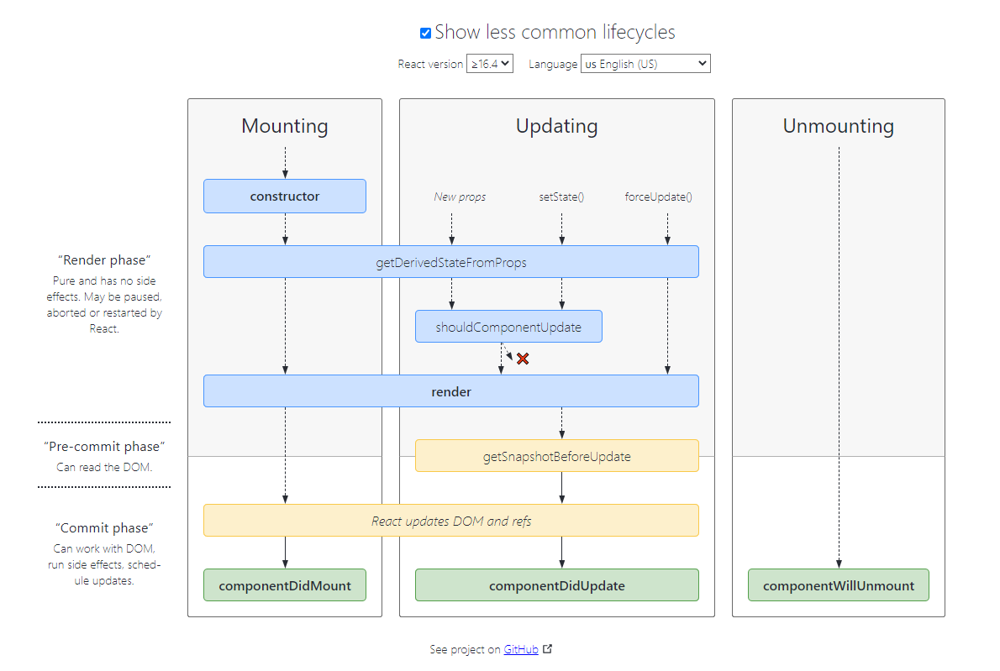

# React

> 官方教程：Hello World – React https://zh-hans.reactjs.org/docs/hello-world.html

[TOC]


## 渲染为DOM: `ReactDOM.render`

假设你的 HTML 文件某处有一个 `<div>`：

```html
<div id="root"></div>
```

我们将其称为“根” DOM 节点，因为该节点内的所有内容都将由 React DOM 管理。

仅使用 React 构建的应用通常只有单一的根 DOM 节点。如果你在将 React 集成进一个已有应用，那么你可以在应用中包含任意多的独立根 DOM 节点。

想要将一个 React 元素渲染到根 DOM 节点中，只需把它们一起传入 [`ReactDOM.render()`](https://zh-hans.reactjs.org/docs/react-dom.html#render)：


```jsx
const element = <h1>Hello, world</h1>;
ReactDOM.render(element, document.getElementById('root'));
```


## 组件

### class组件：`React.Component`

```jsx
class ShoppingList extends React.Component {
  render() {
    return (
      <div className="shopping-list">
        <h1>Shopping List for {this.props.name}</h1>
        <ul>
          <li>Instagram</li>
          <li>WhatsApp</li>
          <li>Oculus</li>
        </ul>
      </div>
    );
  }
}

// 用法示例: <ShoppingList name="Mark" />
```

ShoppingList 是一个 **React 组件类**，或者说是一个 **React 组件类型**。一个组件接收一些参数，我们把这些参数叫做 `props`（“props” 是 “properties” 简写），然后通过 **`render`** 方法返回需要展示在屏幕上的视图的层次结构。

### 函数组件

如果你想写的组件只包含一个 `render` 方法，并且**不包含 state**，那么使用**函数组件**就会更简单。

“类”组件：

```jsx
class Square extends React.Component {
  render() {
    return (
      <button
        className="square"
        onClick={() => this.props.onClick()}
      >
        {this.props.value}
      </button>
    );
  }
}
```

函数组件（直接定义组件的render函数）：

```jsx
function Square(props) {
  return (
    <button className="square" onClick={props.onClick}>
      {props.value}
    </button>
  );
}
```

### `props`：传递数据

**所有 React 组件都必须像纯函数一样保护它们的 props 不被更改。**

在 Board 组件的 `renderSquare` 方法中，我们将代码改写成下面这样，传递一个名为 `value` 的 prop 到 Square 当中：

`<Square value={i} />`

```jsx
class Board extends React.Component {
  renderSquare(i) {
    return <Square value={i} />;  }
}
```

修改 Square 组件中的 `render` 方法，把 `{/* TODO */}` 替换为 `{this.props.value}`，以显示上文中传入的值：

`{this.props.value}`

```jsx
class Square extends React.Component {
  render() {
    return (
      <button className="square">
        {this.props.value}      
      </button>
    );
  }
}
```

### 组件状态：state & setState()

为组件类添加`state`属性

调用`setState`方法更改state，并触发双向绑定更新，重新渲染组件

**构造函数**是唯一可以给 `this.state` 赋值的地方

#### 不可变性

不要直接修改state的属性，而是用新对象替换旧对象。

比如要修改`this.state.squares[]`， 使用`setState`更新整个数组

```js
const squares = this.state.squares.slice();
squares[i] = 'X';
this.setState({ squares: squares })
```

**新数据替换旧数据**

```js
var player = {score: 1, name: 'Jeff'};

var newPlayer = Object.assign({}, player, {score: 2});
// player 的值没有改变, 但是 newPlayer 的值是 {score: 2, name: 'Jeff'}

// 使用对象展开语法，就可以写成：
// var newPlayer = {...player, score: 2};
```

不直接修改（或改变底层数据）这种方式和前一种方式的结果是一样的，这种方式有以下几点好处：

**简化复杂的功能**

不可变性使得复杂的特性更容易实现。在后面的章节里，我们会实现一种叫做“时间旅行”的功能。“时间旅行”可以使我们回顾井字棋的历史步骤，并且可以“跳回”之前的步骤。这个功能并不是只有游戏才会用到——撤销和恢复功能在开发中是一个很常见的需求。不直接在数据上修改可以让我们追溯并复用游戏的历史记录。

**跟踪数据的改变**

如果直接修改数据，那么就很难跟踪到数据的改变。跟踪数据的改变需要可变对象可以与改变之前的版本进行对比，这样整个对象树都需要被遍历一次。

跟踪不可变数据的变化相对来说就容易多了。如果发现对象变成了一个新对象，那么我们就可以说对象发生改变了。

**确定在 React 中何时重新渲染**

不可变性最主要的优势在于它可以帮助我们在 React 中创建 *pure components*。我们可以很轻松的确定不可变数据是否发生了改变，从而确定何时对组件进行重新渲染。

#### State 的更新可能是异步的：

出于性能考虑，React 可能会把多个 `setState()` 调用合并成一个调用。

因为 `this.props` 和 `this.state` 可能会异步更新，所以你不要依赖他们的值来更新下一个状态。

例如，此代码可能会无法更新计数器：

```js
// Wrong
this.setState({
  counter: this.state.counter + this.props.increment,
});
```

要解决这个问题，可以**让 `setState()` 接收一个函数**而不是一个对象。这个函数用上一个 state 作为第一个参数，将此次更新被应用时的 props 做为第二个参数：

```js
// Correct
this.setState((state, props) => ({
  counter: state.counter + props.increment
}));
```

上面使用了[箭头函数](https://developer.mozilla.org/en-US/docs/Web/JavaScript/Reference/Functions/Arrow_functions)，不过使用普通的函数也同样可以：

```js
// Correct
this.setState(function(state, props) {
  return {
    counter: state.counter + props.increment
  };
});
```


```jsx
class Square extends React.Component {
  constructor(props) {
    super(props);
    this.state = {
      value: null,
    };
  }

  render() {
    return (
      <button
        className="square"
        onClick={() => this.setState({value: 'X'})}
      >
        {this.state.value}
      </button>
    );
  }
}
```

### 生命周期 (TODO)

https://projects.wojtekmaj.pl/react-lifecycle-methods-diagram/



https://zh-hans.reactjs.org/docs/react-component.html#reference

```js
// 常用生命周期方法
render()
constructor()
componentDidMount()
componentDidUpdate()
componentWillUnmount()

// 不常用生命周期方法
shouldComponentUpdate()
static getDerivedStateFromProps()
getSnapshotBeforeUpdate()
```


## 事件处理

事件名：小写camelCase

```jsx
<button onClick={activateLasers}>  
	Activate Lasers
</button>
```

### 事件回调中的this

你必须谨慎对待 JSX 回调函数中的 `this`，在 JavaScript 中，class 的方法默认不会[绑定](https://developer.mozilla.org/en/docs/Web/JavaScript/Reference/Global_objects/Function/bind) `this`。

**使用`bind`绑定this**

```jsx
class Toggle extends React.Component {
  constructor(props) {
    super(props);
    this.state = {isToggleOn: true};

    // 为了在回调中使用 `this`，这个绑定是必不可少的
    this.handleClick = this.handleClick.bind(this);
  }

  handleClick() {
    ...
  }

  render() {
    return (
      <button onClick={this.handleClick}>
        ...
      </button>
    );
  }
}
```


如果觉得使用 `bind` 很麻烦，这里有**两种方式**可以解决。

如果你正在使用实验性的 [**public class fields 语法**](https://babeljs.io/docs/plugins/transform-class-properties/)，你可以使用 class fields 正确的绑定回调函数：

```jsx
class LoggingButton extends React.Component {
  // 此语法确保 `handleClick` 内的 `this` 已被绑定。  // 注意: 这是 *实验性* 语法。
  handleClick = () => {    
  	console.log('this is:', this);  
  }
  render() {
    return (
      <button onClick={this.handleClick}>
        Click me
      </button>
    );
  }
}
```

[Create React App](https://github.com/facebookincubator/create-react-app) 默认启用此语法。

如果你没有使用 class fields 语法，你可以在回调中使用[箭头函数](https://developer.mozilla.org/en/docs/Web/JavaScript/Reference/Functions/Arrow_functions)：

```jsx
class LoggingButton extends React.Component {
  handleClick() {
    console.log('this is:', this);
  }

  render() {
    // 此语法确保 `handleClick` 内的 `this` 已被绑定。    
      return (      
          <button onClick={() => this.handleClick()}>
              Click me
          </button>
    );
  }
}
```

此语法问题在于每次渲染 `LoggingButton` 时都会创建不同的回调函数。在大多数情况下，这没什么问题，但如果该回调函数作为 prop 传入子组件时，这些组件可能会进行额外的重新渲染。我们通常建议在构造器中绑定或使用 class fields 语法来避免这类性能问题。

### 向事件处理程序传递参数

**箭头函数** & **bind()**

在循环中，通常我们会为事件处理函数传递额外的参数。例如，若 `id` 是你要删除那一行的 ID，以下两种方式都可以向事件处理函数传递参数：

```jsx
<button onClick={(e) => this.deleteRow(id, e)}>Delete Row</button>
<button onClick={this.deleteRow.bind(this, id)}>Delete Row</button>
```

上述两种方式是等价的，分别通过[箭头函数](https://developer.mozilla.org/en-US/docs/Web/JavaScript/Reference/Functions/Arrow_functions)和 [`Function.prototype.bind`](https://developer.mozilla.org/en-US/docs/Web/JavaScript/Reference/Global_objects/Function/bind) 来实现。

在这两种情况下，React 的事件对象 `e` 会被作为第二个参数传递。如果通过箭头函数的方式，事件对象必须显式的进行传递，而通过 `bind` 的方式，事件对象以及更多的参数将会被隐式的进行传递。


## 条件渲染

### 元素变量

你可以使用变量来储存元素。 它可以帮助你有条件地渲染组件的一部分，而其他的渲染部分并不会因此而改变。

在下面的示例中，我们将创建一个名叫 `LoginControl` 的[有状态的组件](https://zh-hans.reactjs.org/docs/state-and-lifecycle.html#adding-local-state-to-a-class)。

它将根据当前的状态来渲染 `<LoginButton />` 或者 `<LogoutButton />`。同时它还会渲染上一个示例中的 `<Greeting />`。

```jsx
class LoginControl extends React.Component {
  constructor(props) {
    super(props);
    this.handleLoginClick = this.handleLoginClick.bind(this);
    this.handleLogoutClick = this.handleLogoutClick.bind(this);
    this.state = {isLoggedIn: false};
  }

  handleLoginClick() {
    this.setState({isLoggedIn: true});
  }

  handleLogoutClick() {
    this.setState({isLoggedIn: false});
  }

  render() {
    const isLoggedIn = this.state.isLoggedIn;
    let button; // 生名一个变量，存储元素
    if (isLoggedIn) { // 根据条件为button赋值不同元素     
        button = <LogoutButton onClick={this.handleLogoutClick} />;    
    } else {      
        button = <LoginButton onClick={this.handleLoginClick} />;    
    }
    return (
      <div>
        <Greeting isLoggedIn={isLoggedIn} />        
            {button}  
        </div>
    );
  }
}

ReactDOM.render(
  <LoginControl />,
  document.getElementById('root')
);
```

### 与运算符 && （v-if）

通过花括号包裹代码，你可以[在 JSX 中嵌入表达式](https://zh-hans.reactjs.org/docs/introducing-jsx.html#embedding-expressions-in-jsx)。这也包括 JavaScript 中的逻辑与 (&&) 运算符。它可以很方便地进行元素的条件渲染：

```jsx
function Mailbox(props) {
  const unreadMessages = props.unreadMessages;
  return (
    <div>
      <h1>Hello!</h1>
      {unreadMessages.length > 0 &&        
      	<h2>          
        	You have {unreadMessages.length} unread messages.        
        </h2>      
      }    
     </div>
  );
}

const messages = ['React', 'Re: React', 'Re:Re: React'];
ReactDOM.render(
  <Mailbox unreadMessages={messages} />,
  document.getElementById('root')
);
```

之所以能这样做，是因为在 JavaScript 中，`true && expression` 总是会返回 `expression`, 而 `false && expression` 总是会返回 `false`。

因此，如果条件是 `true`，`&&` 右侧的元素就会被渲染，如果是 `false`，React 会忽略并跳过它。

### 三目运算符 (v-if-else)

另一种内联条件渲染的方法是使用 JavaScript 中的三目运算符 [`condition ? true : false`](https://developer.mozilla.org/en/docs/Web/JavaScript/Reference/Operators/Conditional_Operator)。

在下面这个示例中，我们用它来条件渲染一小段文本

```jsx
render() {
  const isLoggedIn = this.state.isLoggedIn;
  return (
    <div>
      The user is <b>{isLoggedIn ? 'currently' : 'not'}</b> logged in.    
     </div>
  );
}
```

同样的，它也可以用于较为复杂的表达式中，虽然看起来不是很直观：

```jsx
render() {
  const isLoggedIn = this.state.isLoggedIn;
  return (
    <div>
      {isLoggedIn        
        ? <LogoutButton onClick={this.handleLogoutClick} />
        : <LoginButton onClick={this.handleLoginClick} />      }
    </div>  
  );
}
```


## 列表 & key

### 渲染多个组件:  map()

你可以通过使用 `{}` 在 JSX 内构建一个[元素集合](https://zh-hans.reactjs.org/docs/introducing-jsx.html#embedding-expressions-in-jsx)。

下面，我们使用 Javascript 中的 [`map()`](https://developer.mozilla.org/en-US/docs/Web/JavaScript/Reference/Global_Objects/Array/map) 方法来遍历 `numbers` 数组。将数组中的每个元素变成 `<li>` 标签，最后我们将得到的数组赋值给 `listItems`：

```jsx
const numbers = [1, 2, 3, 4, 5];
const listItems = numbers.map((number) =>  
	<li>{number}</li>
);
```

我们把整个 `listItems` 插入到 `<ul>` 元素中，然后[渲染进 DOM](https://zh-hans.reactjs.org/docs/rendering-elements.html#rendering-an-element-into-the-dom)：

```jsx
ReactDOM.render(
  <ul>{listItems}</ul>,  document.getElementById('root')
);
```
### key

**在 `map()` 方法中的元素需要设置 key 属性**

一个元素的 key 最好是这个元素在列表中拥有的一个独一无二的字符串。通常，我们使用数据中的 id 来作为元素的 key：
```jsx
const todoItems = todos.map((todo) =>
  <li key={todo.id}>
    {todo.text}
  </li>
);
```
当元素没有确定 id 的时候，万不得已你可以使用元素索引 index 作为 key：
```jsx
const todoItems = todos.map((todo, index) =>
  // Only do this if items have no stable IDs
  <li key={index}>
    {todo.text}
  </li>
);
```

每当一个列表重新渲染时，React 会根据每一项列表元素的 key 来检索上一次渲染时与每个 key 所匹配的列表项。如果 React 发现当前的列表有一个之前不存在的 key，那么就会创建出一个新的组件。如果 React 发现和之前对比少了一个 key，那么就会销毁之前对应的组件。如果一个组件的 key 发生了变化，这个组件会被销毁，然后使用新的 state 重新创建一份。

`key` 是 React 中一个特殊的保留属性（还有一个是 `ref`，拥有更高级的特性）。当 React 元素被创建出来的时候，React 会提取出 `key` 属性，然后把 key 直接存储在返回的元素上。虽然 `key` 看起来好像是 `props` 中的一个，但是你不能通过 `this.props.key` 来获取 `key`。React 会通过 `key` 来自动判断哪些组件需要更新。组件是不能访问到它的 `key` 的。

**我们强烈推荐，每次只要你构建动态列表的时候，都要指定一个合适的 key。**如果你没有找到一个合适的 key，那么你就需要考虑重新整理你的数据结构了，这样才能有合适的 key。

如果你没有指定任何 key，React 会发出警告，并且会把数组的索引当作默认的 key。但是如果想要对列表进行重新排序、新增、删除操作时，把数组索引作为 key 是有问题的。显式地使用 `key={i}` 来指定 key 确实会消除警告，但是仍然和数组索引存在同样的问题，所以大多数情况下最好不要这么做。

组件的 key 值并不需要在全局都保证唯一，只需要在当前的同一级元素之前保证唯一即可。


## 表单

使 React 的 state 成为“唯一数据源”。渲染表单的 React 组件还控制着用户输入过程中表单发生的操作。被 React 以这种方式控制取值的表单输入元素就叫做“**受控组件**”。

`value`绑定state，`onChange`绑定`this.setState({value: event.target.value})`：

注意`onChange`回调方法要**手动绑定this**

```jsx
class NameForm extends React.Component {
  constructor(props) {
    super(props);
    this.state = {value: ''};
	// 回调函数绑定this
    this.handleChange = this.handleChange.bind(this);
    this.handleSubmit = this.handleSubmit.bind(this);
  }

  handleChange(event) {
    // 绑定setState
    this.setState({value: event.target.value});
  }

  handleSubmit(event) {
    alert('提交的名字: ' + this.state.value);
    event.preventDefault();
  }

  render() {
    return (
      <form onSubmit={this.handleSubmit}>
        <label>
          名字:
          {/*注意value和onchange绑定*/}
          <input type="text" value={this.state.value} onChange={this.handleChange} />
        </label>
        <input type="submit" value="提交" />
      </form>
    );
  }
}
```

其他类型表单：

```jsx
<textarea value={this.state.value} onChange={this.handleChange} />

<select value={this.state.value} onChange={this.handleChange}>
	<option value="grapefruit">葡萄柚</option>
    <option value="lime">酸橙</option>
    <option value="coconut">椰子</option>
    <option value="mango">芒果</option>
</select>


```

### 处理多个输入：`name`属性

用同一个onChange回调处理多个表单输入，用`event.target.name`作区分

```jsx
class Reservation extends React.Component {
  constructor(props) {
    super(props);
    this.state = {
      isGoing: true,
      numberOfGuests: 2
    };

    this.handleInputChange = this.handleInputChange.bind(this);
  }

  handleInputChange(event) {
    const target = event.target;
    const value = target.type === 'checkbox' ? target.checked : target.value;
    const name = target.name; // e.target.name 区分表单元素

    this.setState({
      [name]: value // 对应修改
    });
  }

  render() {
    return (
      <form>
        <label>
          参与:
          <input
            name="isGoing"
            type="checkbox"
            checked={this.state.isGoing}
            onChange={this.handleInputChange} />
        </label>
        <br />
        <label>
          来宾人数:
          <input
            name="numberOfGuests"
            type="number"
            value={this.state.numberOfGuests}
            onChange={this.handleInputChange} />
        </label>
      </form>
    );
  }
}
```

### 阻止用户更改表单值

在[受控组件](https://zh-hans.reactjs.org/docs/forms.html#controlled-components)上指定 value 的 prop 会阻止用户更改输入。如果你指定了 `value`，但输入仍可编辑，则可能是你意外地将`value` 设置为 `undefined` 或 `null`。

```jsx
下面的代码演示了这一点。（输入最初被锁定，但在短时间延迟后变为可编辑。）

ReactDOM.render(<input value="hi" />, mountNode);

setTimeout(function() {
  ReactDOM.render(<input value={null} />, mountNode);
}, 1000);
```

## 插槽：`children` prop

使用一个特殊的 `children` prop 来将他们的子组件传递到渲染结果中：

```jsx
function FancyBorder(props) {
  return (
    <div className={'FancyBorder FancyBorder-' + props.color}>
      {props.children}
    </div>
  );
}
```

这使得别的组件可以通过 JSX 嵌套，将任意组件作为子组件传递给它们。

```jsx
function WelcomeDialog() {
  return (
    <FancyBorder color="blue">
      <h1 className="Dialog-title">
        Welcome
      </h1>
      <p className="Dialog-message">
        Thank you for visiting our spacecraft!
      </p>
    </FancyBorder>
  );
}
```

`<FancyBorder>` JSX 标签中的所有内容都会作为一个 `children` prop 传递给 `FancyBorder` 组件。因为 `FancyBorder` 将 `{props.children}` 渲染在一个 `<div>` 中，被传递的这些子组件最终都会出现在输出结果中。

少数情况下，你可能需要在一个组件中预留出几个“洞”。这种情况下，我们可以不使用 `children`，而是自行约定：将所需内容传入 props，并使用相应的 prop。(类似具名插槽)

```jsx
function SplitPane(props) {
  return (
    <div className="SplitPane">
      <div className="SplitPane-left">
        {props.left}
      </div>
      <div className="SplitPane-right">
        {props.right}
      </div>
    </div>
  );
}

function App() {
  return (
    <SplitPane
      left={
        <Contacts />
      }
      right={
        <Chat />
      } />
  );
}
```

